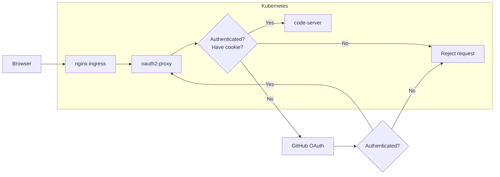

<!-- markdownlint-disable MD028 -->
<!-- markdownlint-disable MD033 -->
# 部署 code-server 並透過 oauth2-proxy 認證

本文件會說明如何部署 code-server 到 Kubernetes 中，並透過 oauth2-proxy 進行使用者的認證

> 本範例中的 oauth2-proxy 不只可以保護 code-server，其它服務也可以透過類似的設定進行保護，因為其身分驗證與認證是在 Ingress 就進行，而非進到服務後才進行。

> oauth2-server 也可以部署成 sidecar 方式，但使用此部署方式 oauth2-proxy 就只能保護該服務

## Table of Contents

- [架構說明](#架構說明)
- [前期準備](#前期準備)
- [部署 oauth2-proxy](#部署-oauth2-proxy)
- [部署 code-server](#部署-code-server)
- [在 code-server 中安裝延伸模組](#在-code-server-中安裝延伸模組)
- [升級 oauth2-proxy 或 code-server 的版本](#升級-oauth2-proxy-或-code-server-的版本)
- [各種問題除錯](#各種問題除錯)
  - [存取 code-server 頁面收到 404 回應](#存取-code-server-頁面收到-404-回應)
  - [存取 code-server 收到 403 回應](#存取-code-server-收到-403-回應)
  - [存取 code-server 看到白畫面](#存取-code-server-看到白畫面)
- [參考資料](#參考資料)

## 架構說明

本專案建構的服務會暴露到外部網路上，因此不使用 code-server 內建的密碼驗證，而是使用 auth2-proxy 進行驗證，透過 auth2-proxy 可以串接第三方來認證身分，且可設定哪些使用者可以存取服務

本專案使用 GitHub 作為 OAuth 的 Identity Provider，因此下面相關的設定 key 名稱會看到 GitHub 字樣

> 若想使用其它 Identity Provider，請將相關的設定值取代為該 Identity Provider 的設定

> ConfigMap 與 Secret 名稱都可以修改，但在 Deployment 中相對應的 key 名稱也要修改，否則 oauth2-proxy 與 code-server 皆會讀不到設定值



整體驗證流程如上圖所示:

1. 由瀏覽器 (或 PWA) 發起請求
2. 進到 Kubernetes 的 nginx-ingress 後，會檢查有沒有攜帶認證身分的 cookie
3. 若有跳到第四步，若無，則重新導向到 oauth2-server，再由 oauth2-server 開始 OAuth2 流程
4. 驗證成功後，始可存取 code-server 功能

## 前期準備

部署相關服務前，需先準備以下項目:

- 單節點或多節點的 Kubernetes 叢集

若希望在 iPad 上使用 code-server，需額外準備以下項目:

- 外部域名
  > 可使用免費的域名，但須可掛 TLS 憑證
- TLS 憑證
  > iPad 只能走 https 協定，自簽憑證也行

## 部署 oauth2-proxy

部署 oauth2-proxy 需要先進行部署檔的修改，這些檔案都放在 `kubernetes-yamls` 資料夾中

這邊請先決定要將 oauth2-proxy 部署在哪個命名空間中，範例是部署到 `kube-system` 命名空間中

> 若該命名空間不存在，請先透過 `kubectl create ns NAMESPACE_NAME` 建立，其中 `NAMESPACE_NAME` 請取代為命名空間的名稱，以此範例來說為 `kube-system`

> 對應的文件也有放註解說明，可以參照該註解進行修改

1. 修改 `oauth2-proxy/oauth2-proxy-configmap-secrets.yaml`
    - 修改 `oauth2-proxy-configmaps.yaml`:
      - 若要部署到不同的命名空間，請修改命名空間名稱
        > 這邊如果修改命名空間名稱，則 Deployment 中也要使用相同的命名空間，否則會取不到值
      - `oauth2Proxy.listenAddr`: 修改 oauth2-proxy 監聽的 IP 與 Port
      - `oauth2Proxy.upstreamAddr`: 修改 Upstream 的位址，這邊因為會部署為 Kubernetes 整個叢集都可以使用，因此會使用 `file:///dev/null` 值
      - `oauth2Proxy.proxyPrefix`: 若 OAuth2 Proxy 是執行於 PathPrefix 模式，建議在這邊將 Ingress 中所設定的路徑前墜 (Path Prefix) 也一併設定到這邊，以利 OAuth2 Proxy 的 CSS 等樣式檔取得
    - 修改 `oauth2-proxy-secrets.yaml`
      > 請注意，Kubernetes 的 Secret 值在 yaml 檔中需先進行 base64 編碼，否則 api-server 會拒絕建立該 Secret
      - 若要部署到不同的命名空間，請修改命名空間名稱
        > 這邊如果修改命名空間名稱，則 Deployment 中也要使用相同的命名空間，否則會取不到值
      - `github.clientId`: Identity Provider 的 客戶端 ID，這邊是放 GitHub 的客戶端 ID
      - `github.clientSecret`：Identity Provider 的客戶端密碼，這邊釋放 GitHub 的客戶端密碼
      - `cookie.secret`: Cookie 的加密種子，請使用[官方網頁提供的方法](https://oauth2-proxy.github.io/oauth2-proxy/configuration/overview#generating-a-cookie-secret)之一產生
      - `codeServer.allowUserId`: 允許存取 code-server 的 GitHub 使用者 ID
2. 修改 `oauth2-proxy/oauth2-proxy-deployment.yaml`:
    - 修改 `oauth2-proxy-deployment.yaml`:
      - `args` 中所示的參數是目前經測試可以正常進行 OAuth 流程的參數，可以依據[官方說明](https://oauth2-proxy.github.io/oauth2-proxy/configuration/overview#config-options)加入自己所需的參數
      - 針對 `env` 區塊，若前面有修改 ConfigMap 或 Secret 的名稱，請在這邊同步進行修改
        > 非常建議將參數值從 ConfigMap 或 Secret 透過環境變數 (Environment Variables) 帶入
      - 若希望使用 4180 以外的連接埠接收請求，請不要修改這邊的 containerPort，而是修改 Service 的 port 值
    - 修改 `oauth2-proxy-service.yaml`
      - 若希望使用 4180 以外的連接埠接收請求，請修改 `spec.ports.port` 設定來達成目的
3. 最後修改 `oauth2-proxy/oauth2-proxy-ingress.yaml`:
    - 若希望透過 Path Prefix 存取 oauth2-proxy，請依據範例與說明修改 `nginx.ingress.kubernetes.io/x-forwarded-prefix`、`nginx.ingress.kubernetes.io/rewrite-target` 與 `spec.rules.http.path` 設定，若要透過子網域存取，請自行搜尋 [Kubernetes Ingress 設定說明文檔](https://kubernetes.io/zh-cn/docs/concepts/services-networking/ingress/)
    - 指定 TLS 網域與 TLS 憑證的 Secret 名稱
4. 完成上述設定的修改後，請依照下面程式碼區塊所列的指令順序依序將檔案部署到 Kubernetes 中

    ```bash
    # 切換目錄
    cd ./kubernetes-yamls/oauth2-proxy
    # 部署 ConfigMap 與 Secret
    kubectl apply -f oauth2-proxy-configmap-secrets.yaml
    # 部署 oauth2-proxy 的 Deployment 與 Service
    kubectl apply -f oauth2-proxy-deployment.yaml
    # 部署 Ingress 設定
    kubectl apply -f oauth2-proxy-ingress.yaml
    ```

5. 依據範例 Ingress 中的設定，存取 `https://www.example.com/path/to/oauth2-proxy` 正常就會看到 oauth2-proxy 的認證畫面
    > 請依據 Ingress 的設定存取你的 oauth2-proxy，上面的網址單純為結合範例的示範網址，其格式為 `https://YOUR_HOST/PATH_TO_OAUTH2_PROXY`，其中 `YOUR_HOST` 為 Ingress 中設定的 host，
    `PATH_TO_OAUTH2_PROXY` 則為 `spec.rules.http.path` 的路徑設定

    > 或是使用子網域的情境，這邊就是直接使用 https 協定存取你的子網域就會看到 oauth2-proxy 的畫面了

## 部署 code-server

部署 code-server 需要先進行部署檔的修改，這些檔案都放在 `kubernetes-yamls` 資料夾中

這邊請先決定要將 code-server 部署在哪個命名空間中，範例是部署到 `devtools` 命名空間中

> 若該命名空間不存在，請先透過 `kubectl create ns NAMESPACE_NAME` 建立，其中 `NAMESPACE_NAME` 請取代為命名空間的名稱，以此範例來說為 `devtools`

> 對應的文件也有放註解說明，可以參照該註解進行修改

1. 修改 `code-server/code-server-pv-and-pvc.yaml`
    > 範例其實是使用 smbv1 將檔案同步到網路硬碟上，但為了簡化說明，這邊提供一般的 PV 綁定方式，若希望可以綁定到網路儲存裝置上，請參閱 Kubernetes 針對 [Persistent Volume](https://kubernetes.io/zh-cn/docs/concepts/storage/volumes/) 與 [PVC](https://kubernetes.io/zh-cn/docs/concepts/storage/persistent-volumes/) 的說明。
    - 修改 `code-server-pv.yaml` 中的 `spec.hostPath.path` 值，將 PV 的資料夾指到正確的路徑
    - 修改 `code-server-pv.yaml` 中的 `spec.capacity.storage` 與 `code-server-pvc.yaml` 中的 `spec.resources.requests.storage`，依據實際需求調整其大小
2. 基本上 `code-server/code-server-configmap-secrets.yaml` 不須進行修改，因為其內容都留預設就可以了
3. 修改 `code-server/code-server-deployment.yaml`
    - 修改 `code-server-deployment.yaml`:
      - 依據實際需求以及檔案內的註解調整 `spec.template.spec.containers` 中找到 `name: code-server` 的 container，調整其下的 `args`
    - 修改 `code-server-service.yaml`
      - 若希望使用不同的連接埠暴露服務，請修改 `spec.ports[0].port` 值
4. 最後修改 `code-server/code-server-ingress.yaml`
    > 請注意，目前此 Ingress 若要正常存取 code-server，必須在網址後方加上 `/`，否則路徑跳轉會不正常
    - 若希望透過 Path Prefix 存取 code-server，請依據範例與說明修改 `nginx.ingress.kubernetes.io/x-forwarded-prefix`、`nginx.ingress.kubernetes.io/rewrite-target` 與 `spec.rules.http.path` 設定，若要透過子網域存取，請自行搜尋 [Kubernetes Ingress 設定說明文檔](https://kubernetes.io/zh-cn/docs/concepts/services-networking/ingress/)
    - 修改 `nginx.ingress.kubernetes.io/auth-signin` 與 `nginx.ingress.kubernetes.io/auth-url`，將 `/path/to/oauth2-proxy` 取代為 oauth2-proxy 正確的 Path
    - 指定 TLS 網域與 TLS 憑證的 Secret 名稱
5. 完成上述設定的修改後，請依照下面程式碼區塊所列的指令順序依序將檔案部署到 Kubernetes 中

    ```bash
    # 切換目錄
    cd ./kubernetes-yamls/code-server
    # 建立命名空間
    # 若命名空間已存在，請跳過這個步驟
    kubectl apply -f devtools
    # 部署 PV 與 PVC
    kubectl apply -f code-server-pv-and-pvc.yaml
    # 部署 ConfigMap 與 Secret
    kubectl apply -f code-server-configmap-secrets.yaml
    # 部署 code-server 的 Deployment 與 Service
    kubectl apply -f code-server-deployment.yaml
    # 部署 Ingress 設定
    kubectl apply -f code-server-ingress.yaml
    ```

6. 依據範例 Ingress 中的設定，存取 `https://www.example.com/path/to/code-server`，由於剛部完一定是未登入狀態，所以會被重新導向到指定的 OAuth2 服務進行登入，以這個範例來說，會跳轉到 GitHub 登入頁面
    > 請依據 Ingress 的設定存取你的 code-server，上面的網址單純為結合範例的示範網址，其格式為 `https://YOUR_HOST/PATH_TO_CODE_SERVER`，其中 `YOUR_HOST` 為 Ingress 中設定的 host，
    `PATH_TO_CODE_SERVER` 則為 `spec.rules.http.path` 的路徑設定

    > 或是使用子網域的情境，這邊就是直接使用 https 協定存取你的子網域就會看到 code-server 的畫面了

    > 如果在存取過程中遇到 404 表示 code-server 的 Ingress 設定有問題，若是遇到 403，則是 oauth2-proxy 的 Ingress 或 cookie 等設定有問題

## 在 code-server 中安裝延伸模組

經過測試，目前 code-server 無法直接透過使用者介面進行延伸模組的安裝，需要依據以下步驟進行安裝

1. 先到[第三方的套件網站](https://open-vsx.org/)下載指定的延伸模組
    > 或是可以在延伸模組的頁面點選市集直接打開頁面
2. 將 vsix 檔案放到部署時 PV 指定的目錄
3. 在 code-server 中打開終端機，並透過以下指令安裝套件

    > 請將 `YOUR_EXTENSION_FILENAME` 取代為下載下來的 vsix 檔案名稱

    ```bash
    code-server --install-extension YOUR_EXTENSION_FILENAME
    ```

4. 安裝完成後就可以在 code-server 的延伸模組面板中看到該延伸模組了
    > 安裝完成後，PV 資料夾底下的 vsix 檔案就可以刪除了

## 升級 oauth2-proxy 或 code-server 的版本

不論是 oauth2-proxy 或 code-server，升級版本只需重新部署即可，因為 image 的 tag 是選擇 latest

## 各種問題除錯

### 存取 code-server 頁面收到 404 回應

可以初步先確認以下項目:

- code-server 的 Ingress 設定是否正確
- 瀏覽器的網址是否符合 Ingress 的設定

### 存取 code-server 收到 403 回應

基本上會收到 403 回應肯定是 oauth2-proxy 的設定或 Ingress 有寫錯，可以逐步確認以下問題

- oauth2-proxy Ingress 中 path 設定是否正確
- oauth2-proxy Ingress 中 rewrite-target 與 Deployment args 項目中 `--proxy-prefix` 的設定是否相符
- 檢查 oauth2-proxy Deployment 的 args 中 `--cookie-secure` 參數是否有設成 false
- 檢查 oauth2-proxy Deployment 與 Cookie 相關的設定是否太過嚴謹，基本上針對 Cookie 的設定適當就好，過於嚴謹的設定可能會導致服務無法正常存取
- 檢查 oauth2-proxy Deployment 的 args 中 `--reverse-proxy` 參數是否有設成 true

### 存取 code-server 看到白畫面

檢查 Ingress 設定的 rewrite-target 有沒有寫對

### oauth2-proxy 的 CSS 樣式沒有被正確套用

檢查以下項目

- oauth2-proxy Ingress 中 rewrite-target 與 Deployment args 項目中 `--proxy-prefix` 的設定是否相符
- 檢查 oauth2-proxy Deployment 的 args 中 `--skip-auth-regex` 是否有設成 `/oauth2/static($|/)(.*)`

## 參考資料

- [OAuth2 Proxy 為你的後台提供認證](https://weii.dev/oauth2-proxy/)
- [Lock down your Kubernetes services with OAuth2 Proxy](https://dev.to/styren/lock-down-your-kubernetes-services-with-oauth2-proxy-28d9)
- [coder/code-server - GitHub](https://github.com/coder/code-server)
- [oauth2-proxy/oauth2-proxy - GitHub](https://github.com/oauth2-proxy/oauth2-proxy)
- [oauth2-proxy Docs](https://oauth2-proxy.github.io/oauth2-proxy/)
- [Open VSX Registry](https://open-vsx.org/)
- [Is there a way to put Kubernetes secret value in args field of yaml file](https://stackoverflow.com/a/50248608)
- [Rewrite - Examples - Ingress-Nginx Controller](https://kubernetes.github.io/ingress-nginx/examples/rewrite/)
- [Annotations - Ingress-Nginx Controller](https://kubernetes.github.io/ingress-nginx/user-guide/nginx-configuration/annotations/#permanent-redirect)
- [Configure Snippet - Annotations - kubernetes/ingress-nginx - GitHub](https://github.com/kubernetes/ingress-nginx/blob/main/docs/user-guide/nginx-configuration/annotations.md#configuration-snippet)
- [[nginx] Redirect with added trailing slash - GitHub](https://github.com/kubernetes/ingress-nginx/issues/646)
- [Nginx ingress controller rewrite-target annotation and rule to add a trailing slash to url](https://stackoverflow.com/a/65941913)
- [ingress 路徑設定中類型exact|prefix|ImplementationSpecific的區別以及設定](https://blog.csdn.net/Monarchess_1234/article/details/130743905)
- [NGINX Variables - Javatpoint](https://www.javatpoint.com/nginx-variables)
- [External OAUTH Authentication - kubernetes/ingress-nginx - GitHub](https://github.com/kubernetes/ingress-nginx/blob/main/docs/examples/auth/oauth-external-auth/README.md)
- [oauth2-proxy.yaml - kubernetes/ingress-nginx - GitHub](https://github.com/kubernetes/ingress-nginx/blob/main/docs/examples/auth/oauth-external-auth/oauth2-proxy.yaml)
- [重新導向 URL - 授權 OAuth 應用 - GitHub 文件](https://docs.github.com/zh/apps/oauth-apps/building-oauth-apps/authorizing-oauth-apps#redirect-urls)
- [How do I install an extension? - Coder FAQ](https://coder.com/docs/code-server/FAQ#how-do-i-install-an-extension)
- [iPad - coder/code-server - GitHub](https://github.com/coder/code-server/blob/main/docs/ipad.md#access-code-server-using-servediter)
- [Using Open VSX in VS Code - eclipse/openvsx Wiki - GitHub](https://github.com/eclipse/openvsx/wiki/Using-Open-VSX-in-VS-Code)
